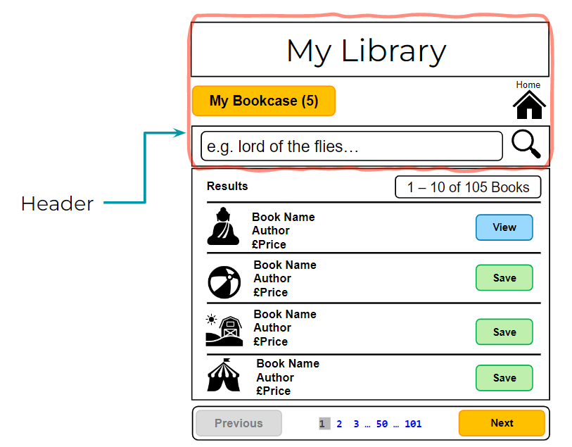

# Bookcase App: My Library

## Task: My Library App - Interface Components

1. Separate and highlight the possible components of this interface or design your own:<br/>Some example components:
    - Header
    - Search Bar
    - Pagination
    - Book
    - List of Books Container
    - Navigation




## Task: My Library App - Install

1. In Visual Code open the folder `bookcase-app` folder under the `react-starter-files` folder

1. In the Visual Code terminal install the dependencies with the following command: 
```shell
npm install
````
3. To run the project call the start command from a terminal:

```shell 
npm start 
```
The initial structure of our app will be as follows: 

```JS
<App>
    <Book/>
    <Book/>
    <Book/>
    <Book/>
    {/* Multiple <Book/> elements */}
</App>
```

Each `<Book>` tag is a JSX element and will be a functional component defined in a file called [Book.js][3]

Explore the files in the `bookcase-app` folder.

4. __What is displayed in the browser and why❔__

1. Change the text displayed in the browser

1. Using the [`useState`][1] hook set a variable called books containing the [books.json][4] data. <br/><br/>Examples of how to do this can be found in last week's session.<br/><br/>You can also search online for [examples of using `useState` hook][1].

```js
const [books] = useState(data);
```
7. Instead of returning one single `<Book>` component, use a loop to display all the books in the data object

1. Consider using  the JavaScript [`Array.map`][2] function 

```js
return books.map(book => <Book key={book.id} book={book}/>);
```
9. Update the [Book.js][4] file so it returns the attributes of a book e.g.

```js
import React from 'react';

const Book = (props) => {
   return (
    <div>
      {/* Code below displays the book title */}
      <h2>{props.book.volumeInfo.title}</h2>
      {
        /*
        Add other JSX elements that will return:
        -Author Name
        -Thumbnail Image
        -Book Price 
        */
      }
    </div>
   );
}
export default Book;
```


10. Replace the comments in the code with the corresponding properties of your book.
<br/>_TIP: You can use [object destructuring][5] to unpack the object attributes into variables_

1. Review the [book.json][4] file to understand the available attributes.

1. In the example we are displaying a book __title__ using [props][6]:

```js
props.book.volumeInfo.title
```

## Task: Adding Type Checking

1. In the __bookcase-app__, add [type checking][7] for the following attributes of the `<Book>` component (_Hint: Add your code to the [Book.js][3] file_)

    - title
    - authors
    - retailPrice.amount
    - description
    - thumbnailImage

1. Add default attributes using the defaultProps

1. Open the browser's developer tools to see the warning messages returned by the validators

## Homework: Event Handling

1. Open the `bookcase-app`

1. We should have an [App.js][8] file which returns a list of `<Book/>` components:

```js
/*App.js returns <Book/> components */

const App = (props) => {
  const [books] = useState(data);
  return books.map(book => <Book book={book}/>)
}
```

3. Run the app:

```shell
npm start
```
4. In the browser view the console window for the results of clicking the buttons


[1]:https://reactjs.org/docs/hooks-state.html
[2]:https://developer.mozilla.org/en-US/docs/Web/JavaScript/Reference/Global_Objects/Array/map
[3]:/bookcase-app/src/components/Book.js
[4]:/bookcase-app/src/models/books.json
[5]:https://developer.mozilla.org/en-US/docs/Web/JavaScript/Reference/Operators/Destructuring_assignment#object_destructuring
[6]:https://reactjs.org/docs/components-and-props.html
[7]:https://reactjs.org/docs/typechecking-with-proptypes.html
[8]:/bookcase-app/src/App.js