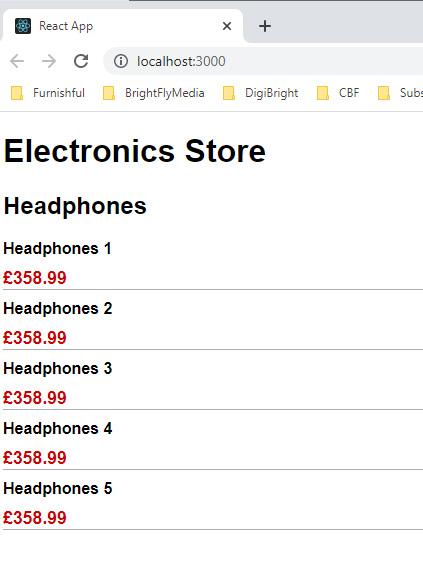
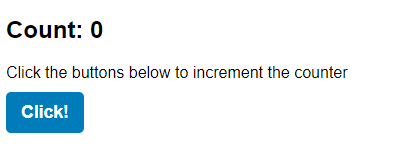

# Props & States

## Task: Understanding Props & State

1. Open this folder in VS Code. Open a terminal

1. The `props-and-state` folder contains a React project created using the `create-react-app` command

1. In your terminal window install the dependencies by running the command below:

```shell
npm install
```
4. Run the project from the terminal using the following command:

```shell
npm start
```
5. Explore the code in [index.js](src/index.js) and [components/GadgetList.js](src/components/GadgetList.js) file. Try to  understand how the code relates to the HTML that is displayed on the screen.

1. The following will be displayed when the project is run:


- The [index.js](src/index.js) file sets a variable with an array of objects called headphones
```JS
const headphones =  [....];
```

Each object has a title property.

```JS
{"title":"Headphones 1"}
```

- Review the code, find the `useState` hook. 

- What do you think it is doing? 

- Read the React documentation on [React Hooks](https://reactjs.org/docs/hooks-intro.html) for more information.
```JS
const [headphonesList] = useState(headphones);
```

7. Add another object to the headphones variable:
```JS
{"title":"Headphones 5"}
```

8. Add a price attribute to all the headphone objects 

```JS
{"title":"Headphones 5", "price":358.99}
```

9. Update the [GadgetList.js](src/components/GadgetList.js) to display the price.

1. Add style attributes to the `title` and `price` to improve the display:


11. Open the developer tools in your browser. Although the code compiles and runs successfully you should see this warning:


12. Follow the [link to more information](https://reactjs.org/link/warning-keys) to resolve the warning in the code. 

_Hint: you will need to add unique IDs/Keys to each headphones object and add a key attribute when displaying them in the `GadgetList` component_

## Task: useState Hook - ClickCounter.js

1. Create a new file called ClickCounter.js under the components  folder

1. Add the code for a functional component called ClickCounter that increments a counter when a button is clicked

_HINT: Use the code from the  previous slide_



3. Add a button called "Unclick". When a user clicks "Unclick", decrement the counter accordingly

1. You'll need to add code to [index.js](src/index.js) to add the new component to the page

1. Ensure the counter cannot go below 0

1. Add some style to the `<ClickCounter/>` component’s elements


## Task: Import External JSON  Data

1. Open this project (__props-and-state__) in Visual Code

1. The file [src/models/headphones.json](src/models/headphones.json) contains a list of objects with more attributes such as __price__ and image fields

1. Add the import code to the [index.js](src/index.js) file to import the JSON into a variable which can be passed to the `useState` hook.

1. Update the code to display all the titles in the [headphones.json](src/models/headphones.json) file. You can do this by updating the variable passed to the `useState` hook

1. The image attribute in the [headphones.json](src/models/headphones.json) file point to images in the [public/imgs](public/imgs/) folder, e.g [imgs/dre-beats4.png](public/imgs/dre-beats4.png)

1. Display the images using an image element: `` . You will need to update the code in the [GadgetList.js](src/components/GadgetList.js) file.

